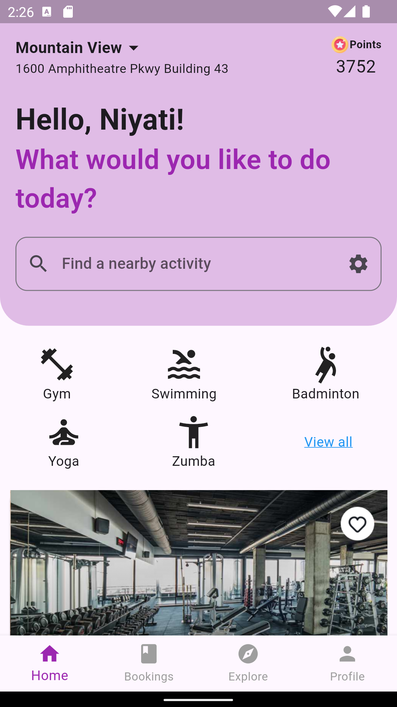
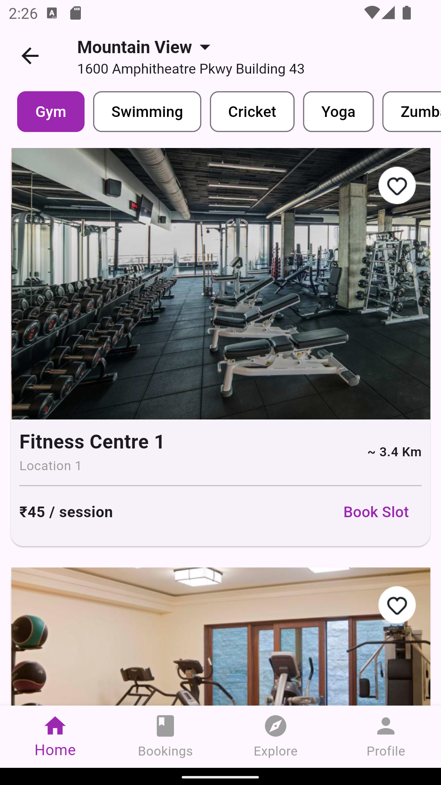

# AroundMe - Fitness Center Finder

AroundMe is a Flutter application designed to help users find nearby fitness centers and activities. The app provides a seamless and user-friendly interface to explore various fitness options like gyms, swimming pools, badminton courts, yoga classes, and more.

## Table of Contents

- [Screenshots](#screenshots)
- [Installation](#installation)
- [Usage](#usage)
- [File Structure](#file-structure)
- [Dependencies](#dependencies)
- [Contributing](#contributing)

## Screenshots

### Home Screen

### List Screen


## Installation

### Prerequisites

- Flutter SDK: [Installation Guide](https://flutter.dev/docs/get-started/install)
- Dart SDK
- A code editor (e.g., VS Code, Android Studio)

### Steps

1. **Clone the repository**:
    ```sh
    git clone https://github.com/your-username/around_me.git
    cd around_me
    ```

2. **Install dependencies**:
    ```sh
    flutter pub get
    ```

3. **Run the application**:
    ```sh
    flutter run
    ```

## Usage

1. Launch the app on your device or emulator.
2. Allow location permissions for the app to detect your current location.
3. Explore nearby fitness centers and activities.
4. Use the search bar to find specific activities.
5. Navigate through different sections using the bottom navigation bar.

## File Structure

```
around_me/
├── lib/
│   ├── bottom_nav_bar.dart         # Bottom navigation bar widget
│   ├── card_widget.dart            # Card widget for fitness centers
│   ├── home_page.dart              # Home page of the app
│   ├── list_screen.dart            # List screen for displaying fitness centers
│   └── main.dart                   # Main entry point of the app
├── images/
│   ├── img.png                     
│   ├── img_1.png                   
│   ├── img_2.png                  
│   ├── img_3.png
│   └── img_4.png
├── screenshots/
│   ├── home_screen.png             # Screenshot of the home screen
│   └── list_screen.png             # Screenshot of the list screen
├── pubspec.yaml                    # Project dependencies and assets
└── README.md                       # Project README file
```

## Dependencies

- **flutter**: SDK for building mobile applications.
- **location**: Provides location services.
- **geocoding**: Provides geocoding services to convert coordinates to addresses.

For a full list of dependencies, see the `pubspec.yaml` file.

## Output


## Contributing

Contributions are welcome! Please feel free to submit a Pull Request or open an Issue for any bugs or feature requests.

### Steps to Contribute

1. Fork the repository.
2. Create your feature branch: `git checkout -b feature/your-feature-name`.
3. Commit your changes: `git commit -m 'Add some feature'`.
4. Push to the branch: `git push origin feature/your-feature-name`.
5. Open a Pull Request.